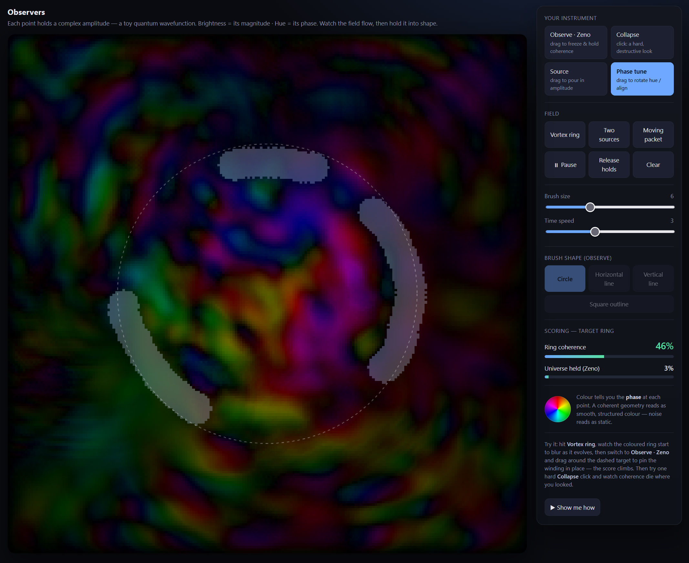

# Observers

An interactive toy quantum wavefunction — a complex field you shape by observing,
collapsing, sourcing, and phase-tuning.



Each cell holds a complex amplitude. Brightness is magnitude; hue is phase. The field
evolves with a Schrödinger-style symplectic update. Use **Observe · Zeno** to freeze
coherence along a path, **Collapse** for a hard destructive measurement, **Source** to
pour in amplitude, and **Phase tune** to rotate hue. Hit **Show me how** for a short
self-playing walkthrough.

This repository is also a **sandbox for the brief / ledger / chronicle workflow** —
specs live in `docs/briefs/`, execution is recorded in per-brief `ledger.md` files, and
`/chronicle` turns that record into a narrative history. The game is the working product;
the docs tree is the demonstration of how that process runs on a real codebase.

## Requirements

Recent Node.js and npm.

## Run locally

```bash
npm install
npm run dev
```

Other scripts:

```bash
npm run build       # typecheck + production build
npm run typecheck
npm run test
```

## Controls

| Control | What it does |
|---|---|
| Observe · Zeno | Drag to freeze and hold coherence |
| Collapse | Click for a hard, destructive look |
| Source | Drag to pour in amplitude |
| Phase tune | Drag to rotate hue / align phase |
| Vortex ring / Two sources / Moving packet | Seed field patterns |
| Brush size / Time speed | Instrument and evolution rate |
| Brush shape | Circle, lines, or square (Observe) |
| Show me how | Self-playing demo on the live field |

The side panel is the full instrument — this table is only a cheat sheet.

## Stack

Vite + TypeScript (no framework); Vitest for tests.

## License

[MIT](LICENSE) © Josha Stella
